# Nexus Sync: Decouple Your Teams

**Language:** Java | **Prereqs:** Temporal Workflows, Activities, Worker

---

## Scenario

You work at a bank. Every payment goes through **three steps**:

1. **Validate** the payment (amount, accounts)
2. **Check compliance** (risk assessment, sanctions screening)
3. **Execute** the payment (call the gateway)

Two teams own this process:

<table>
<tr>
<th>Team</th>
<th>Owns</th>
<th>Task Queue</th>
</tr>
<tr>
<td><strong>&#x1F4B3; Payments</strong></td>
<td>Steps 1 &amp; 3 — validate and execute</td>
<td><code>payments-processing</code></td>
</tr>
<tr>
<td><strong>&#x1F50D; Compliance</strong></td>
<td>Step 2 — risk assessment &amp; regulatory checks</td>
<td><code>compliance-risk</code></td>
</tr>
</table>

### The Problem

Right now, **both teams' code runs on the same Worker**. One process. One deployment. One blast radius.

This is a **security and operational risk problem**. The Compliance team deals with sensitive regulatory work — OFAC sanctions screening, anti-money laundering (AML) monitoring, risk decisions — that requires stricter access controls, separate audit trails, and its own release cycle. Payments has none of those constraints. But because both teams share a single process, they're forced into the same failure domain, the same security perimeter, and the same deploy pipeline.

Here's what that sharing a single process can look like in practice: The Compliance team ships a bug at 3am. Their code crashes. But it's running on the Payments worker — so **Payments goes down too**. Same blast radius. Same 3am page. Two teams, one shared fate.

You could split them with REST calls between microservices. But now you've got a new problem: if Compliance is down when Payments calls it, the request is lost. No retries. No durability. You're writing your own retry loops, circuit breakers, and dead letter queues. You've traded one problem for three.

### The Solution: Temporal Nexus

[**Nexus**](https://docs.temporal.io/nexus) gives you team boundaries **with** durability. Each team gets its own Worker, its own deployment pipeline, its own security perimeter, its own blast radius — while Temporal manages the durable, type-safe calls between them.

The Payments workflow calls the Compliance team through a Nexus operation. If the Compliance Worker goes down mid-call, the payment workflow just... waits. When Compliance comes back, it picks up exactly where it left off. No retry logic. No data loss. No 3am page for the Payments team.

The best part? The code change is almost invisible:

```java
// BEFORE (monolith — direct activity call):
ComplianceResult compliance = complianceActivity.checkCompliance(compReq);

// AFTER (Nexus — durable cross-team call):
ComplianceResult compliance = complianceService.checkCompliance(compReq);
```

Same method name. Same input. Same output. Completely different architecture.

## Quickstart Docs By Temporal

:rocket: [Get started in a few mins](https://docs.temporal.io/quickstarts?utm_campaign=awareness-nikolay-advolodkin&utm_medium=code&utm_source=github)

---

## Overview

<p align="center">
  
</p>

The diagram above shows the decoupled architecture you'll build in this exercise. On the left, the **Payments** team owns validation and execution — the entry and exit points of every transaction. 

On the right, the **Compliance** team owns risk assessment and sanctions screening, isolated behind a **Nexus security boundary**. 

When a payment arrives, data flows left-to-right: the Payments workflow validates the request, hands it across the Nexus boundary for a compliance check, then executes the payment once cleared. The flow illustrates how transaction data crosses the team boundary durably — if the Compliance side goes down mid-check, the payment resumes when it comes back, with zero data loss.

> **Interactive version:** Open [`ui/nexus-decouple.html`](ui/nexus-decouple.html) in your browser to toggle between Monolith and Nexus modes with animated data flow.

### What You'll Build

```text
BEFORE (Monolith):                    AFTER (Nexus Decoupled):
┌─────────────────────────┐           ┌──────────────┐    ┌──────────────┐
│   Single Worker         │           │  Payments    │    │  Compliance  │
│   ─────────────         │           │  Worker      │    │  Worker      │
│   Workflow              │           │  ──────      │    │  ──────      │
│   PaymentActivity       │    →      │  Workflow    │◄──►│  NexusHandler│
│   ComplianceActivity    │           │  PaymentAct  │    │  Checker     │
│                         │           │              │    │              │
│   ONE blast radius      │           │  Blast #1    │    │  Blast #2   │
└─────────────────────────┘           └──────────────┘    └──────────────┘
                                              ▲ Nexus ▲
```

---

## Checkpoint 0: Run the Monolith

Before changing anything, let's see the system working. You need **3 terminal windows** and a running Temporal server.

**Terminal 0 — Temporal Server** (if not already running):
```bash
temporal server start-dev
```

**Terminal 1 — Start the monolith worker:**
```bash
cd exercise-1300a-nexus-sync/exercise
mvn compile exec:java@payments-worker
```

You should see:
```log
Payments Worker started on: payments-processing
Registered: PaymentProcessingWorkflow, PaymentActivity
            ComplianceActivity (monolith — will decouple)
```

**Terminal 2 — Run the starter.** The starter kicks off **three executions** of the same `PaymentProcessingWorkflow` — each with a different transaction that exercises a different risk level:
```bash
cd exercise-1300a-nexus-sync/exercise
mvn compile exec:java@starter
```

**Expected results:**

<table>
<tr>
<th>Transaction</th>
<th>Amount</th>
<th>Route</th>
<th>Risk</th>
<th>Result</th>
</tr>
<tr>
<td><code>TXN-A</code></td>
<td>$250</td>
<td>US &#x2192; US</td>
<td>&#x1F7E2; LOW</td>
<td>&#x2705; <code>COMPLETED</code></td>
</tr>
<tr>
<td><code>TXN-B</code></td>
<td>$12,000</td>
<td>US &#x2192; UK</td>
<td>&#x1F7E0; MEDIUM</td>
<td>&#x2705; <code>COMPLETED</code></td>
</tr>
<tr>
<td><code>TXN-C</code></td>
<td>$75,000</td>
<td>US &#x2192; North Korea</td>
<td>&#x1F534; HIGH</td>
<td>&#x1F6AB; <code>DECLINED_COMPLIANCE</code></td>
</tr>
</table>

:white_check_mark: **Checkpoint 0 passed** if all 3 transactions complete with the expected results. The system works! Now let's decouple it.

> **Stop the worker** (Ctrl+C in Terminal 1) before continuing.

---

## Your 5-Step Decoupling Plan

In this exercise, you're going to pull Compliance out of the Payments Worker and into its own independent Worker, connected through a Nexus boundary. Steps 1-3 build the Compliance side (contract, handler, Worker), and steps 4-5 rewire the Payments side to call it through Nexus instead of a local Activity.

<table>
<tr>
<th>#</th>
<th>File</th>
<th>Action</th>
<th>Key Concept</th>
</tr>
<tr>
<td><strong>1</strong></td>
<td><code>shared/nexus/ComplianceNexusService.java</code></td>
<td>&#x1F7E2; Create</td>
<td>Shared contract between teams</td>
</tr>
<tr>
<td><strong>2</strong></td>
<td><code>compliance/temporal/ComplianceNexusServiceImpl.java</code></td>
<td>&#x1F7E2; Create</td>
<td>Compliance handles incoming Nexus calls</td>
</tr>
<tr>
<td><strong>3</strong></td>
<td><code>compliance/temporal/ComplianceWorkerApp.java</code></td>
<td>&#x1F7E2; Create</td>
<td>Compliance gets its own worker</td>
</tr>
<tr>
<td><strong>4</strong></td>
<td><code>payments/temporal/PaymentProcessingWorkflowImpl.java</code></td>
<td>&#x1F7E1; Modify</td>
<td>One-line swap changes the architecture</td>
</tr>
<tr>
<td><strong>5</strong></td>
<td><code>payments/temporal/PaymentsWorkerApp.java</code></td>
<td>&#x1F7E1; Modify</td>
<td>Payments points to the new endpoint</td>
</tr>
</table>

---

## Checkpoint 0.5: Create the Nexus Endpoint

Before implementing the TODOs, register the [Nexus endpoint](https://docs.temporal.io/glossary#nexus-endpoint) with Temporal. This tells Temporal: *"When someone calls `compliance-endpoint`, route it to the `compliance-risk` task queue."*
Without this, the Payments Worker has no way to route calls to the Complaince Worker. 

```bash
temporal operator nexus endpoint create \
  --name compliance-endpoint \
  --target-namespace default \
  --target-task-queue compliance-risk
```

You should see:
```log
Endpoint compliance-endpoint created.
```

> **Analogy:** This is like adding a contact to your phone. The endpoint name is the contact name; the task queue is the phone number. You only do this once.

---

## TODO 1: Create the Nexus Service Interface

**File:** `shared/nexus/ComplianceNexusService.java`

This is the **shared contract** between teams — like an OpenAPI spec, but durable. Both teams depend on this interface. *"Shared contract" means both the Payments and Compliance teams agree on exactly what method to call, what data goes in, and what comes back — without knowing anything about each other's internals.*

**What to add:**
1. `@Service` annotation on the interface — marks this as a Nexus service that Temporal can discover and route to
2. One method: `checkCompliance(ComplianceRequest) → ComplianceResult` — the single operation the Compliance team exposes
3. `@Operation` annotation on that method — marks it as a callable Nexus operation (a service can have multiple operations, but we only need one here)

**Pattern to follow:**
```java
@Service
public interface ComplianceNexusService {
    @Operation
    ComplianceResult checkCompliance(ComplianceRequest request);
}
```

> **Tip:** The `@Service` and `@Operation` annotations come from `io.nexusrpc`, NOT from `io.temporal`. Nexus is a protocol — Temporal implements it, but the interface annotations are protocol-level.

---

## TODO 2: Implement the Nexus Handler

**File:** `compliance/temporal/ComplianceNexusServiceImpl.java`

This is the **waiter** that takes orders from the Payments team and passes them to the **chef** (ComplianceChecker).

**Two new annotations:**
- `@ServiceImpl(service = ComplianceNexusService.class)` — goes on the class; tells Temporal "this is the implementation of the contract from TODO 1"
- `@OperationImpl` — goes on each handler method; pairs it with the matching `@Operation` in the interface

**What to implement:**
1. Add `@ServiceImpl` annotation pointing to the interface
2. Add a `ComplianceChecker` field and accept it via constructor — the handler receives requests but delegates the actual work to the checker
3. Create a `checkCompliance()` method that returns `OperationHandler<ComplianceRequest, ComplianceResult>` — this is Nexus's wrapper type that lets Temporal handle retries, timeouts, and routing for you
4. Inside that method, return `WorkflowClientOperationHandlers.sync((ctx, details, client, input) -> checker.checkCompliance(input))` — `sync` means the operation runs inline and returns a result right away, as opposed to `async` which would kick off a full workflow (you'll see that in a later exercise)

> **Key insight:** The handler method name must **exactly match** the interface method name. `checkCompliance` in the interface = `checkCompliance()` in the handler. Temporal matches by name.

> **Sync vs Async:** This is a sync handler — it runs inline and returns immediately. You'll learn about async handlers (which start full workflows on the other side) in a later exercise.

---

## TODO 3: Create the Compliance Worker

**File:** `compliance/temporal/ComplianceWorkerApp.java`

Standard **CRAWL** pattern with one new step:

```text
C — Connect to Temporal
R — Register (no workflows in this Worker)
A — Activities (none — logic lives in the Nexus handler)
W — Wire the Nexus service implementation  ← NEW
L — Launch
```

**The key new method:**
```java
worker.registerNexusServiceImplementation(
    new ComplianceNexusServiceImpl(new ComplianceChecker())
);
```

Compare to what you already know:
```java
// Activities (you've done this before):
worker.registerActivitiesImplementations(...)

// Nexus (new — same shape, different method name):
worker.registerNexusServiceImplementation(...)
```

**Task queue:** `"compliance-risk"` — must match the `--target-task-queue` from the CLI endpoint creation.

---

## Checkpoint 1: Compliance Worker Starts

```bash
cd exercise-1300a-nexus-sync/exercise
mvn compile exec:java@compliance-worker
```

:white_check_mark: **Checkpoint 1 passed** if you see:
```log
Compliance Worker started on: compliance-risk
```

If it fails to compile, check:
- TODO 1: Does `ComplianceNexusService` have `@Service` and `@Operation`?
- TODO 2: Does `ComplianceNexusServiceImpl` have `@ServiceImpl` and `@OperationImpl`?
- TODO 3: Are you connecting to Temporal and registering the Nexus service?

> **Keep the compliance worker running** — you'll need it for Checkpoint 2.

---

## TODO 4: Replace Activity Stub with Nexus Stub

**File:** `payments/temporal/PaymentProcessingWorkflowImpl.java`

This is the **key teaching moment**. You're swapping one line of code that changes the entire architecture.

**BEFORE:**
```java
private final ComplianceActivity complianceActivity =
    Workflow.newActivityStub(ComplianceActivity.class, ACTIVITY_OPTIONS);

// In processPayment():
ComplianceResult compliance = complianceActivity.checkCompliance(compReq);
```

**AFTER:**
```java
private final ComplianceNexusService complianceService = Workflow.newNexusServiceStub(
    ComplianceNexusService.class,
    NexusServiceOptions.newBuilder()
        .setOperationOptions(NexusOperationOptions.newBuilder()
            .setScheduleToCloseTimeout(Duration.ofMinutes(2))
            .build())
        .build());

// In processPayment():
ComplianceResult compliance = complianceService.checkCompliance(compReq);
```

**What changed:**

<table>
<tr>
<th>&#x1F534; Before (Monolith)</th>
<th>&#x1F7E2; After (Nexus)</th>
</tr>
<tr>
<td><code>Workflow.newActivityStub()</code></td>
<td><code>Workflow.newNexusServiceStub()</code></td>
</tr>
<tr>
<td><code>ComplianceActivity.class</code></td>
<td><code>ComplianceNexusService.class</code></td>
</tr>
<tr>
<td><code>ActivityOptions</code></td>
<td><code>NexusServiceOptions</code> + <code>scheduleToCloseTimeout</code></td>
</tr>
<tr>
<td><code>complianceActivity.</code></td>
<td><code>complianceService.</code></td>
</tr>
</table>

**What stayed the same:**
- `.checkCompliance(compReq)` — identical call
- `ComplianceResult` — same return type
- All surrounding logic — untouched

> **Where does the endpoint come from?** Not here! The workflow only knows the **service** (`ComplianceNexusService`). The **endpoint** (`"compliance-endpoint"`) is configured in the worker (TODO 5). This keeps the workflow portable.

---

## TODO 5: Update the Payments Worker

**File:** `payments/temporal/PaymentsWorkerApp.java`

Two changes:

**CHANGE 1:** Register the workflow with `NexusServiceOptions`:
```java
worker.registerWorkflowImplementationTypes(
    WorkflowImplementationOptions.newBuilder()
        .setNexusServiceOptions(Collections.singletonMap(
            "ComplianceNexusService",      // interface name (no package)
            NexusServiceOptions.newBuilder()
                .setEndpoint("compliance-endpoint")  // matches CLI endpoint
                .build()))
        .build(),
    PaymentProcessingWorkflowImpl.class);
```

**CHANGE 2:** Remove `ComplianceActivityImpl` registration:
```java
// DELETE these lines:
ComplianceChecker checker = new ComplianceChecker();
worker.registerActivitiesImplementations(new ComplianceActivityImpl(checker));
```

> **Analogy:** You're removing the compliance department from your building and adding a phone extension to their new office. The workflow dials the same number (`checkCompliance`), but the call now routes across the street.

---

## Checkpoint 2: Full Decoupled End-to-End

You need **4 terminal windows** now:

**Terminal 0:** Temporal server (already running)

**Terminal 1 — Compliance worker** (already running from Checkpoint 1, or restart):
```bash
cd exercise-1300a-nexus-sync/exercise
mvn compile exec:java@compliance-worker
```

**Terminal 2 — Payments worker** (restart with your changes):
```bash
cd exercise-1300a-nexus-sync/exercise
mvn compile exec:java@payments-worker
```

**Terminal 3 — Starter:**
```bash
cd exercise-1300a-nexus-sync/exercise
mvn compile exec:java@starter
```

:white_check_mark: **Checkpoint 2 passed** if you get the **exact same results** as Checkpoint 0:

<table>
<tr>
<th>Transaction</th>
<th>Risk</th>
<th>Result</th>
</tr>
<tr>
<td><code>TXN-A</code></td>
<td>&#x1F7E2; LOW</td>
<td>&#x2705; <code>COMPLETED</code></td>
</tr>
<tr>
<td><code>TXN-B</code></td>
<td>&#x1F7E0; MEDIUM</td>
<td>&#x2705; <code>COMPLETED</code></td>
</tr>
<tr>
<td><code>TXN-C</code></td>
<td>&#x1F534; HIGH</td>
<td>&#x1F6AB; <code>DECLINED_COMPLIANCE</code></td>
</tr>
</table>

Same results, completely different architecture. Two workers, two blast radii, two independent teams.

> **Check the Temporal UI** at http://localhost:8233 — you should see Nexus operations in the workflow event history!

---

## Victory Lap: Durability Across the Boundary

This is where it gets fun. Let's prove that Nexus is **durable** — not just a fancy RPC.

1. **Start both workers** (if not already running)
2. **Run the starter** in another terminal
3. **While TXN-B is processing**, kill the compliance worker (Ctrl+C in Terminal 1)
4. Watch the payment workflow **pause** — it's waiting for the Nexus operation to complete
5. **Restart the compliance worker**
6. Watch the payment workflow **resume and complete**

The payment workflow didn't crash. It didn't timeout. It didn't lose data. It just... waited. Because Temporal + Nexus handles this automatically.

> **Try this with REST:** Kill the compliance service mid-request. What happens? Connection reset. Transaction lost. 3am page. With Nexus, the workflow simply picks up where it left off.

---

## Quiz

Test your understanding before moving on:

**Q1:** Where is the Nexus endpoint name (`"compliance-endpoint"`) configured?

<details>
<summary>Answer</summary>

In `PaymentsWorkerApp`, via `NexusServiceOptions` → `setEndpoint("compliance-endpoint")`. The **workflow** only knows the service interface. The **worker** knows the endpoint. This separation keeps the workflow portable.

</details>

**Q2:** What happens if the Compliance worker is down when the Payments workflow calls `checkCompliance()`?

<details>
<summary>Answer</summary>

The Nexus operation will be retried by Temporal until the `scheduleToCloseTimeout` expires (2 minutes in our case). If the Compliance worker comes back within that window, the operation completes successfully. The Payment workflow just waits — no crash, no data loss.

</details>

**Q3:** What's the difference between `@Service/@Operation` and `@ServiceImpl/@OperationImpl`?

<details>
<summary>Answer</summary>

- `@Service` / `@Operation` (from `io.nexusrpc`) go on the **interface** — the shared contract both teams depend on
- `@ServiceImpl` / `@OperationImpl` (from `io.nexusrpc.handler`) go on the **handler class** — the implementation that only the Compliance team owns

Think of it as: the interface is the **menu** (shared), the handler is the **kitchen** (private).

</details>

---

## What's Next?

You've just learned the fundamental Nexus pattern: **same method call, different architecture**. Everything that follows builds on this foundation.

Next up: upgrade from `sync()` to `fromWorkflowMethod()` — where the Compliance side starts a full Temporal workflow instead of running inline. That's where Nexus truly shines: long-running, durable operations across team boundaries.

---

*Nexus Sync: Decouple Your Teams*
*Part of [Temporal Warmups](https://github.com/temporalio/temporal-warmups)*
